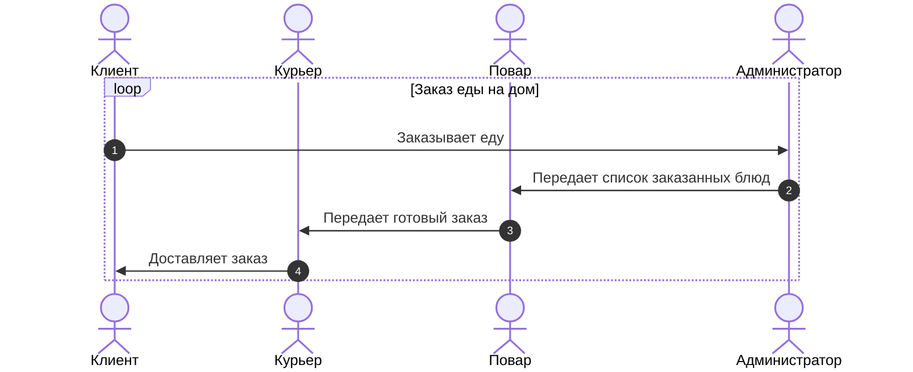

# GitUML
## Заказ и доставка еды из ресторана

```mermaid
sequenceDiagram
actor C as Клиент
actor K as Курьер
actor P as Повар
actor A as Администратор
autonumber
loop Заказ еды на дом
C->>A: Заказывает еду
A->>P: Передает список заказанных блюд
P->>K: Передает готовый заказ
K->>C: Доставляет заказ
end
```